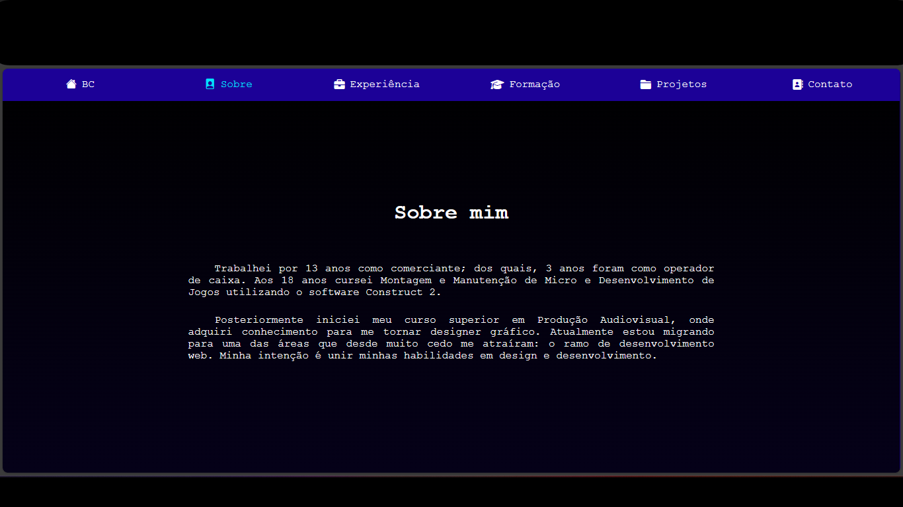

# Bruno Coelho

Este site foi criado para servir como meu portfolio. 

## Descrição

Neste site irei expor meus principais projetos e experiências profissionais.

## Demonstração

## Tecnologias Utilizadas

 - [x] HTML
 - [x] CSS
 - [x] JAVASCRIPT
 - [x] GIT

## Layout

Layout 1

Layout 2

Layout 3

Layout 4

Layout 5

Layout 6

## Contato
 - Whatsapp: (81) 9 8920-6365
 - E-mail: brunocoelho66@gmail.com
 - [Linkedin](https://www.linkedin.com/in/dev-bcoelho)
 - [Github](https://github.com/BMinority)

